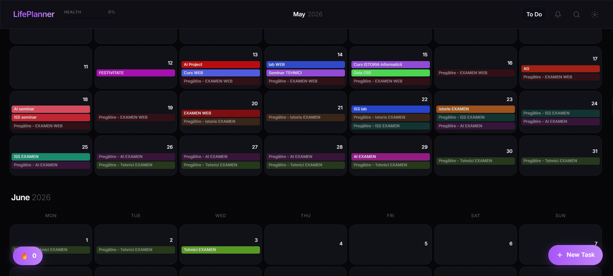
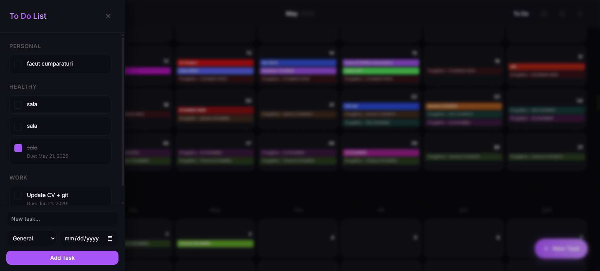

# 📅 AcademicFlow / LifePlanner – Academic & Habit Management System

**AcademicFlow (LifePlanner)** is a personal productivity platform designed to centralize academic scheduling, track daily habits, and manage deadline-driven tasks. The application features an interactive dashboard calendar, habit consistency heatmaps, and a dedicated task management workflow.

---

## 📸 Screenshots

| Infinite Calendar & Dashboard View | Task & Habit Sidebar |
| :---: | :---: |
|  |  |


---

## ✨ Key Features

- 🗓️ **Infinite Calendar & Dashboard:** Centralized view for recurring academic classes, events, and daily schedules.
- 🔥 **Habit Tracking & Heatmap (Streaks):** Real-time consistency score calculations displayed on a dynamic streak widget.
- 📝 **Task & Preparation Management:** Organize single-day or multi-day tasks, complete with custom preparation days (`prepDays`).
- 📊 **Healthy Stats & Todo Sidebar:** Slide-out drawer offering quick task filtering, status updates, and productivity metrics.
- 🎨 **Premium Dark Theme:** Fully customizable UI supporting dynamic theme switching and smooth layout transitions.

---

## 🛠️ Tech Stack

### Frontend
- **Framework & Build Tool:** React.js, Vite
- **Styling:** Tailwind CSS, PostCSS
- **State & Logic:** React Hooks, Custom Services

### Backend
- **Runtime & Framework:** Node.js, Express.js (REST APIs)
- **ORM & Database:** Prisma ORM, PostgreSQL / SQLite
- **Architecture:** Layered Architecture (Routes, Controllers, Services)

---

## 📁 Repository Structure

```text
LifePlanner/
├── backend/
│   ├── prisma/                  # Prisma ORM Schema & Database Migrations
│   ├── src/
│   │   ├── controllers/         # API Controllers (taskController, todoController)
│   │   ├── middleware/          # Express Middlewares
│   │   ├── routes/              # Express API Routes (taskRoutes, todoRoutes, notificationRoutes)
│   │   ├── services/            # Business Logic Services (taskService, todoService)
│   │   └── index.js             # Express Server Entry Point
│   ├── .env                     # Environment Variables
│   └── package.json             # Backend Dependencies & Scripts
│
└── frontend/
    ├── src/
    │   ├── components/          # React Components (Calendar, TodoSidebar, TaskForm, DayView)
    │   ├── hooks/               # Custom React Hooks
    │   ├── services/            # API Services & Axios instances
    │   ├── utils/               # Utility functions (Theme handling, Date formatting)
    │   ├── App.jsx              # Main React Application Component
    │   ├── index.css            # Global CSS & Tailwind imports
    │   └── main.jsx             # React Application Entry Point
    ├── index.html               # Main HTML Document
    ├── tailwind.config.js       # Tailwind CSS Configuration
    ├── vite.config.js           # Vite Build Configuration
    └── package.json             # Frontend Dependencies & Scripts
